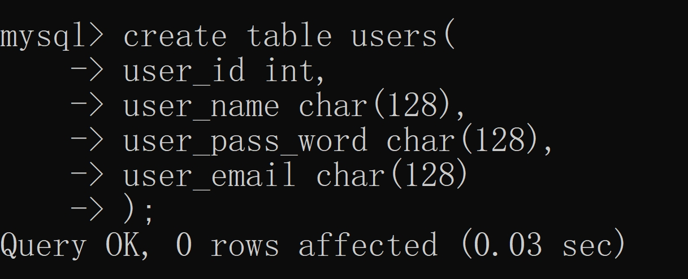

## 1.ORM映射定义

对于对象结构体而言，先说一下实体类的类名定义方式:

### (1)类名定义方式

比如`User`，如果存在一个用户对象，可以定义为`User`，必须有以下规则：

* 类名大写,比如`U`大写

* 不能加`s`，因为在查询时，表会自动在数据库中匹配它的复数形势，比如存在一个`User`数组`user`，在数据库匹配时，会自动匹配复数形势`users`。

### (2)属性

* 属性字段的首字母必须大写

* 当属性字段由多个单词组成时，每个单词的首字母必须大写

* 每个属性字段后面跟的`json`，不影响属性字段和数据库的匹配，其代表着返回对象的属性字段的替代

## 2.数据库创建方式

ORM映射关系的数据库创建时，必须满足以下条件：

* 数据库名格式:

> (因为MySQL不区分大小写)，根据`model`与`models`的对应关系，如果存在一个`User`的实体类，那么必须创建一个名为`Users`的数据库。

* 属性字段格式:

> 当一个属性字段由多个单词组成时，不同单词时间使用空格分割，如下图。



```golang
type User struct {
	UserId       int    `json:"userId"`
	UserName     string `json:"userName"`
	UserPassWord string `json:"userPassword"`
	UserEmail    string `json:"userEmail"`
}
```